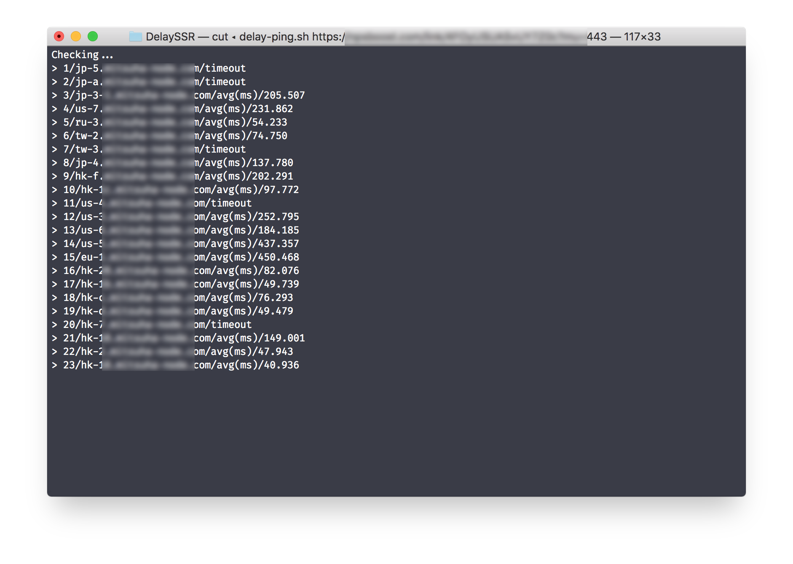
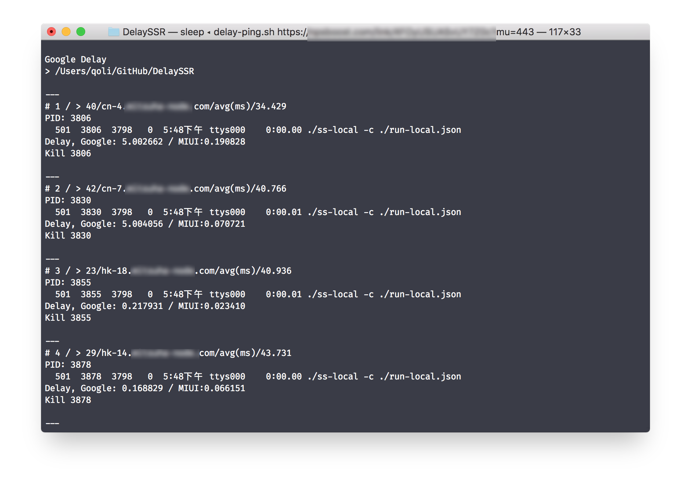

# DelaySSR
檢測 SSR 線路的 Ping 延遲和 Google 延遲

## 更新記錄

##### 2018年07月21日

* 追加單獨 SSR:// 測試支持
* 追加多個 SSR 測試支持（命令行）
* test 文件使用 `python2.7 ./delay-config.py` 調用腳本

##### 2018年07月21日之前

發佈初始版本

## 系統要求

- [x] Mac OS
- [x] Python 2.7

## 命令運作原理

1. delay-ping.sh 會讀取 SSR 訂閱地址，下載 SSR 伺服器列表，透過 ping 檢查與服務器延遲（IMCP）。
2. 把可 Ping 通的伺服器記錄在 LogDelay_working_sort.txt 文件上，再由 delay-test.sh 腳本使用 ss-local 建立與 Google 延遲的測試。
3. delay-config.py 腳本用於生成 ss-local 可用的 config.json 文件

為了方便分離 Ping 測試延遲流程和 ss-local 測試 Google 延遲流程，所以分開兩個腳本運作。

## 命令說明

`delay-ping.sh ssr訂閱地址`

delay-ping.sh 會從 SSR 訂閱地址下載并測試 Ping 延遲并輸出排序結果文件 LogDelay_working_sort。

`delay-ping.sh ssr-ssr`

delay-ping.sh 測試多個 SSR://，使用「-」中橫線分割。

`delay-test.sh 測試頭 N 個伺服器`

delay-test.sh 會根據 LogDelay_working_sort 結果文件，測試頭 N 個伺服器的 Google 延遲并輸出 LogDelay_Google.txt 結果文件。

`delay-config.py 伺服器名稱`

delay-config.py 會根據傳入<u>伺服器名稱</u>從 LogDelay_ssr_list.txt 結果文件輸出 config.json 配置文本。

## 命令使用

`delay-ping.sh SSR訂閱地址`

將會生成如圖的測試結果，耐心等待執行完畢。將會自動調用 `./delay-test.sh 10` 測試延遲最低的 10 個伺服器。

最終查看 LogDelay_Google.txt 和 LogDelay_working_sort.txt 兩個結果文件即可。

